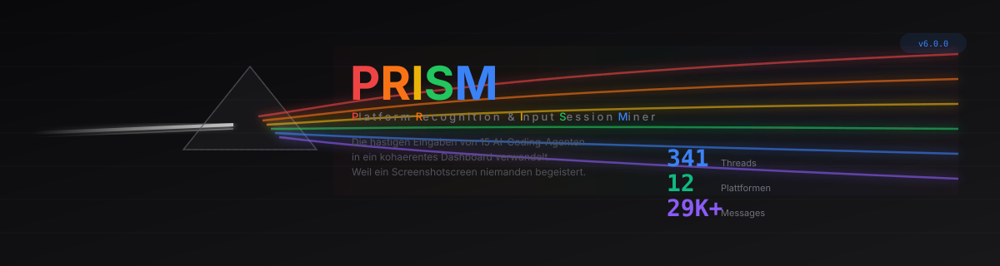
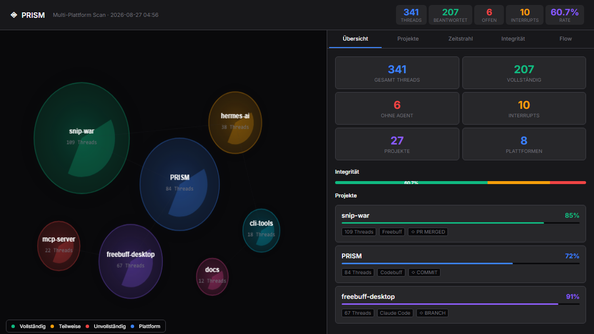
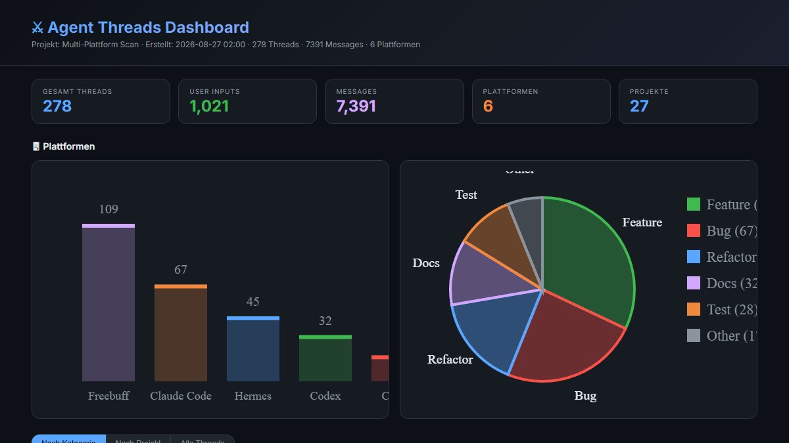
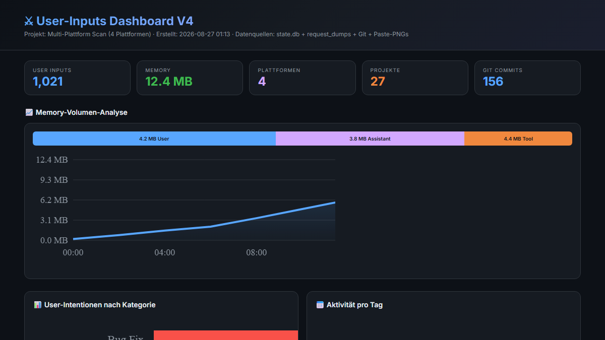

<p align="center">
  
</p>

<p align="center">
  <strong>P</strong>latform <strong>R</strong>ecognition &amp; <strong>I</strong>nput <strong>S</strong>ession <strong>M</strong>iner<br>
  <em>Die hastigen Eingaben von 15+ AI-Coding-Agenten in ein kohärentes Dashboard verwandelt.</em>
</p>

<p align="center">
  
  
  
  
  
</p>

---

## Was ist PRISM?

Stell dir vor, du hast 15+ AI-Coding-Agenten installiert. Nicht weil du sie brauchst, sondern weil jeder mal "interessant" klang. Claude Code, Gemini, Hermes, Codex, Freebuff, Cursor, Cline, Roo, Kilo, OpenHands, Amp, Aider, Goose, Kiro... Jeder speichert seine Daten irgendwo anders. Manche in SQLite, manche in JSONL, manche in Protobuf-Blobs.

PRISM ist die Antwort auf eine Frage, die niemand gestellt hat: *"Was wenn ich ALLE meine AI-Sessions in einem Dashboard sehen könnte?"*

Die Antwort ist: Es wäre ein chaotisch-farbenes Pie-Chart mit zu vielen Datenpunkten. Also haben wir PRISM gebaut.

---

## Dashboard-Vorschau

<p align="center">
  
  <br>
  <em>Interaktives Canvas-Dashboard mit Pie-Chart-Bubbles und Drill-Down Navigation</em>
</p>

PRISM generiert interaktive Dashboards in verschiedenen Ansichten:

| Dashboard | Beschreibung | Vorschau |
|-----------|-------------|----------|
| **Canvas** | Pie-Charts als Bubbles, Drill-Down, Git-Integration | [Öffnen](docs/screenshots/canvas-preview.html) |
| **Threads** | Kategorisierte Thread-Ansicht mit Filtern | [Öffnen](docs/screenshots/threads-preview.html) |
| **User Inputs** | Detaillierte User-Input-Analyse mit Charts | [Öffnen](docs/screenshots/user-inputs-preview.html) |

### Features

- 🎯 **Pie-Chart-Bubbles** pro Projekt (Kategorie-Verteilung)
- 🔍 **Drill-Down** von Projekt → Threads → Messages
- 🏷️ **COMMIT/PR/BRANCH-Badges** für jeden Thread
- 🔗 **Git-Integration** mit automatischem Matching
- 📊 **34 dedizierte Plattform-Reader** (kein Generic-Fallback)
- 🧹 **Fuzzy-Deduplizierung** via SimHash + Jaccard
- 📈 **Memory-Volumen-Analyse** (User vs. Assistant vs. Tool)
- ⏱️ **Commit-Timeline** mit automatischer Korrelation
- 🌐 **Portabel** — keine hardcoded Pfade, работает auf Windows/macOS/Linux

---

## Plattformen

PRISM unterstützt **34+ AI-Coding-Agenten** und erkennt automatisch, welche installiert sind. Die Plattformen sind nach Kategorie gruppiert:

### 🖥️ CLI-Agenten

| Plattform | Vendor | Datenformat | Beschreibung |
|-----------|--------|-------------|--------------|
| **Claude Code** | Anthropic | JSONL | `~/.claude/history.jsonl` + Project-Transcripts |
| **Gemini CLI** | Google | JSONL + SQLite | `~/.gemini/antigravity-cli/history.jsonl` + Conversations |
| **Codex** | OpenAI | JSONL + SQLite | `~/.codex/sessions/` + State-DB |
| **Aider** | Aider-AI | Markdown | `.aider.chat.history.md` |
| **OpenCode** | SST | SQLite | `~/.local/share/opencode/opencode.db` |
| **OpenHands** | All Hands AI | JSON | `~/.openhands-state/` |
| **Amp** | Sourcegraph | JSON | `~/.local/share/amp/threads/` |
| **Grok Build** | xAI | JSONL | `~/.grok/sessions/*/updates.jsonl` |
| **Kiro** | Amazon | JSON + SQLite | `~/.kiro/sessions/cli/` + SQLite |
| **Goose** | AAIF | SQLite | `~/.local/share/goose/sessions/sessions.db` |
| **Prime Agent** | PrimeIntellect | JSON | `~/.prime/agent/sessions/` |
| **Pi Agent** | Earendil Works | JSONL | `~/.pi/agent/sessions/` |
| **Junie** | JetBrains | JSONL | `~/.junie/sessions/*/events.jsonl` |
| **Kimchi** | Kimchi | JSON | `~/.config/kimchi/harness/sessions/` |
| **Kimi CLI** | MoonshotAI | JSON | `~/.kimi/sessions/` |
| **Qwen CLI** | Alibaba | JSON | `~/.qwen/projects/` |
| **Mux** | Coder | JSON | `~/.mux/sessions/` |
| **Senpi** | code-yeongyu | JSON | `~/.senpi/agent/sessions/` |
| **Beads** | Beads | SQLite | `.beads/beads.db` (per-project) |

### 🪟 Desktop-Agenten

| Plattform | Vendor | Datenformat | Beschreibung |
|-----------|--------|-------------|--------------|
| **Gemini Desktop** | Google | Protobuf + SQLite | `~/.gemini/antigravity/conversations/` |
| **Claude Desktop** | Anthropic | Server-side | `%APPDATA%/Claude/` |
| **Codex Desktop** | OpenAI | Server-side | `%LOCALAPPDATA%/Codex/` |
| **ChatGPT Desktop** | OpenAI | Server-side | `%LOCALAPPDATA%/ChatGPT/` |
| **Cursor** | Cursor | SQLite | `state.vscdb` (agentKv blobs) |
| **Windsurf** | Codeium | SQLite | `state.vscdb` (Cascade chats) |
| **Zed Agent** | Zed | SQLite | `threads.db` |
| **Freebuff/Codebuff** | Codebuff | Directory | `~/.config/manicode/` |

### 🔌 VS Code Extensions

| Plattform | Vendor | Datenformat | Beschreibung |
|-----------|--------|-------------|--------------|
| **GitHub Copilot** | GitHub/Microsoft | OTEL + JSON | `~/.copilot/otel/` + workspaceStorage |
| **Cline** | Cline | JSON | Task-History in globalStorage |
| **Roo Code** | RooCodeInc | JSON | Cline-Fork, Task-History |
| **Kilo Code** | Kilo-Org | JSON + SQLite | Task-History + `kilo.db` |
| **Continue.dev** | Continue (Cursor) | JSON | globalStorage |

### 🔧 Besondere Plattformen

| Plattform | Vendor | Besonderheit |
|-----------|--------|--------------|
| **Hermes Agent** | NousResearch | 3-Table-JOIN (session+message+part) in SQLite |
| **Kilo Code** | Kilo-Org | 3-Table-JOIN mit SimHash-Dedup |
| **Freebuff** | Codebuff | Teilt Daten mit Codebuff unter `~/.config/manicode/` |
| **Cursor** | Cursor | `agentKv`-Blobs in VS Code SQLite |

---

## Schnellstart

```bash
# Klonen und installieren
git clone https://github.com/vannon091118/PRISM.git
cd PRISM
pip install jinja2  # Optional, für volle Visualisierung

# Welche Plattformen sind installiert?
python -m parse_user_inputs --discover

# Canvas-Dashboard generieren
python -m parse_user_inputs --canvas --html dashboard.html

# Thread-Ansicht generieren
python -m parse_user_inputs --threads --html threads.html

# User-Inputs Dashboard
python -m parse_user_inputs --html user_inputs.html

# Alle Plattformen scannen
python -m parse_user_inputs --scan --all

# Bestimmte Plattform
python -m parse_user_inputs --platform claude_code
```

<p align="center">
  
  <br>
  <em>Thread-Ansicht mit Kategorien, Plattformen und Filtern</em>
</p>

---

## Architektur

```
parse_user_inputs/
├── cli.py                 # ~80 Zeilen, delegiert an modes/
├── config.py              # Portabel — keine hardcoded Pfade
├── categorizer.py         # 18 Kategorien mit Negative-Keywords
├── models.py              # Thread + Message Dataclasses
├── platforms.py           # 34 Plattform-Definitionen
├── sorting.py             # Fuzzy-Dedup (SimHash + Jaccard)
│
├── sources/               # Je eine Datei pro Plattform
│   ├── hermes.py          # state.db 3-Table-JOIN
│   ├── freebuff.py        # API + PRs + Branches
│   ├── claude_code.py     # history.jsonl + transcripts
│   ├── gemini_cli.py      # history.jsonl + conversations
│   ├── gemini_desktop.py  # Protobuf-decoded sessions
│   ├── kilo_code.py       # 3-Table-JOIN (!)
│   ├── cursor.py          # agentKv blobs (state.vscdb)
│   ├── codex.py           # Sessions + SQLite
│   ├── git_reader.py      # Git-Commits + Matching
│   └── ...               # 12+ Module total
│
├── renderers/             # HTML, Canvas, Markdown, JSON
├── modes/                 # threads, scan, project
├── templates/             # Canvas-Dashboard (standalone)
└── tests/                 # 52 Tests
```

<p align="center">
  
  <br>
  <em>User-Inputs Dashboard mit Memory-Analyse, Charts und Reasoning-Snippets</em>
</p>

---

## Technische Details

### Datenformate

PRISM liest eine Vielzahl von Datenformaten:

| Format | Plattformen | Beschreibung |
|--------|-------------|--------------|
| **JSONL** | Claude Code, Gemini CLI, Codex, Aider | Zeilenweise JSON-Logs |
| **SQLite** | Hermes, Kilo Code, Cursor, Codex, Zed, OpenCode, Goose | relationale Datenbanken |
| **Protobuf** | Gemini Desktop | komprimierte Sessions |
| **JSON** | Cline, Roo Code, Copilot, OpenHands | Task- und Chat-History |
| **Markdown** | Aider | Lesbare Chat-Logs |
| **OTEL** | Copilot | OpenTelemetry-Logs |

### Deduplizierung

PRISM verwendet **SimHash + Jaccard-Ähnlichkeit** für Fuzzy-Deduplizierung:

- **SimHash**: Kompakte Hash-Darstellung für schnellen Vergleich
- **Jaccard**: Set-Ähnlichkeit für semantic Matching
- **Threshold**: 85% Ähnlichkeit = Duplikat

### Git-Integration

PRISM matchingt automatisch:
- **Commits** → Threads (nach Zeitstempel + Projekt)
- **Branches** → Threads (nach Branch-Name)
- **PRs** → Threads (nach PR-Titel + Branch)

---

## Warum "PRISM"?

Weil ein Prisma Licht nimmt und in ein Spektrum bricht.

PRISM nimmt die chaotische Masse an Session-Logs, Datenbanken
und Chat-History-Dateien aus 34+ Plattformen und bricht sie
in sauber kategorisierte, farbcodierte, interaktive Visualisierungen.

Und weil der Name kurz, einprägsam und nicht
`AISessionParser3000ProMaxUltra` heißt.

---

## Selbstironischer Disclaimer

PRISM wurde gebaut, um die eigene Produktivität zu steigern.
Die Ironie: Die meiste Zeit wurde damit verbracht, PRISM selbst
zu bauen, anstatt die eigentlichen Projekte fertigzustellen.

Das ist wie ein Schreiner, der ein perfektes Werkzeug-Regal baut,
statt das Regal zu bauen, für das er die Werkzeuge braucht.

Aber immerhin sieht das Dashboard jetzt gut aus.

---

## License

MIT — weil die Welt genug proprietäre AI-Tools hat.
